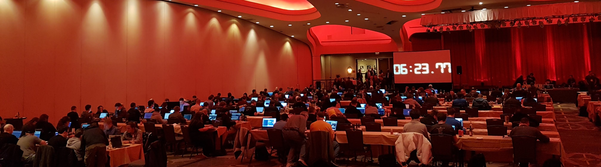

### Hi, I'm Amine Raji

AI security consultant. I help engineering and security teams deploy LLM systems without creating new attack surfaces.

My background is in securing critical systems across regulated industries. More recently I've been working with enterprise clients on building and deploying LLM-based systems — model selection, RAG pipelines, agentic workflows, production infrastructure on Kubernetes. That combination puts me in an unusual position: I understand how these systems are built, and I understand how they're broken.

**What I focus on:**
- Prompt injection & jailbreaks
- Data leakage through model outputs
- Agentic system risk & privilege escalation
- Supply chain & model integrity
- LLM security assessments & implementation consulting

**Where to find me:**
- 🌐 [molntek.com](https://molntek.com) — AI security consulting
- ✍️ [aminrj.com](https://aminrj.com) — writing and notes

---

