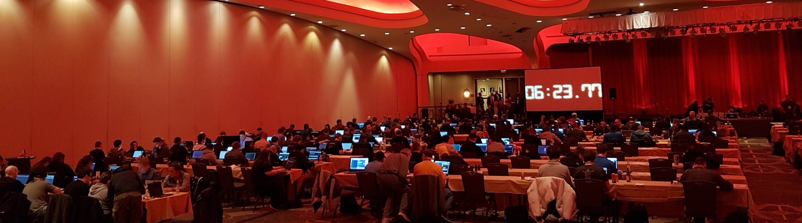

### Hi, I'm Amine Raji

AI security researcher focused on how agentic AI systems create attack surfaces that traditional AppSec tooling cannot see. 
My background is in securing critical systems across regulated industries: aerospace, banking, defense, and automotive. 

More recently my work has centered on MCP and agentic AI: building lab-confirmed attack chains, publishing threat models, and mapping what breaks in production. That combination puts me in an unusual position: I understand how these systems are built, and I understand how they're broken.

**What I focus on:**
- Prompt injection & jailbreaks
- Data leakage through model outputs
- Agentic system risk & privilege escalation
- Supply chain & model integrity
- LLM security assessments & implementation consulting

**Where to find me:**
- 🌐 [molntek.com](https://molntek.com) — AI security consulting
- ✍️ [aminrj.com](https://aminrj.com) — writing and notes

---

